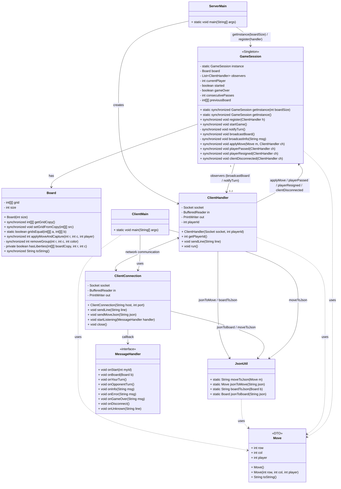

```mermaid
classDiagram
    direction TB

%% ======================
%% COMMON
%% ======================
    class Move {
        <<DTO>>
        + int row
        + int col
        + int player
        + Move()
        + Move(int row, int col, int player)
        + String toString()
    }

    class Board {
        - int[][] grid
        - int size

        + Board(int size)
        + synchronized int[][] getGridCopy()
        + synchronized void setGridFromCopy(int[][] src)
        + static boolean gridsEqual(int[][] a, int[][] b)

        + synchronized int applyMoveAndCapture(int r, int c, int player)
        - synchronized int removeGroup(int r, int c, int color)
        - private boolean hasLiberties(int[][] boardCopy, int r, int c)
        + synchronized String toString()
    }

    class JsonUtil {
        + static String moveToJson(Move m)
        + static Move jsonToMove(String json)
        + static String boardToJson(Board b)
        + static Board jsonToBoard(String json)
    }


%% ======================
%% SERVER
%% ======================
    class GameSession {
        <<Singleton>>
        - static GameSession instance
        - Board board
        - List~ClientHandler~ observers
        - int currentPlayer
        - boolean started
        - boolean gameOver
        - int consecutivePasses
        - int[][] previousBoard

        + static synchronized GameSession getInstance(int boardSize)
        + static synchronized GameSession getInstance()
        + synchronized void register(ClientHandler h)
        + synchronized void startGame()
        - synchronized void notifyTurn()
        + synchronized void broadcastBoard()
        - synchronized void broadcastInfo(String msg)
        + synchronized void applyMove(Move m, ClientHandler ch)
        + synchronized void playerPassed(ClientHandler ch)
        + synchronized void playerResigned(ClientHandler ch)
        + synchronized void clientDisconnected(ClientHandler ch)
    }

    class ClientHandler {
        - Socket socket
        - BufferedReader in
        - PrintWriter out
        - int playerId

        + ClientHandler(Socket socket, int playerId)
        + int getPlayerId()
        + void sendLine(String line)
        + void run()
    }

    class ServerMain {
        + static void main(String[] args)
    }


%% ======================
%% CLIENT
%% ======================
    class ClientConnection {
        - Socket socket
        - BufferedReader in
        - PrintWriter out

        + ClientConnection(String host, int port)
        + void sendLine(String line)
        + void sendMoveJson(String json)
        + void startListening(MessageHandler handler)
        + void close()
    }

    class ClientMain {
        + static void main(String[] args)
    }

%% MessageHandler is an internal interface of ClientConnection
    class MessageHandler {
        <<interface>>
        + void onStart(int myId)
        + void onBoard(Board b)
        + void onYourTurn()
        + void onOpponentTurn()
        + void onInfo(String msg)
        + void onError(String msg)
        + void onGameOver(String msg)
        + void onDisconnect()
        + void onUnknown(String line)
    }

%% ======================
%% RELATIONS
%% ======================

%% Server flow: ServerMain creates handlers and registers them in GameSession
    ServerMain --> ClientHandler : creates
    ServerMain --> GameSession : getInstance(boardSize) / register(handler)

%% GameSession manages handlers (Observer)
    GameSession "1" --> "0..2" ClientHandler : observers (broadcastBoard / notifyTurn)

%% GameSession uses Board
    GameSession --> Board : has

%% ClientHandler uses GameSession and JsonUtil
    ClientHandler --> GameSession : applyMove / playerPassed / playerResigned / clientDisconnected
    ClientHandler --> JsonUtil : jsonToMove / boardToJson
    
%% Server–Client communication
    ClientHandler <--> ClientConnection : network communication

%% Client side relations
    ClientMain --> ClientConnection : uses
    ClientConnection --> MessageHandler : callback
    ClientConnection --> JsonUtil : jsonToBoard / moveToJson
    ClientMain --> JsonUtil : moveToJson
%% Move dependencies
    ClientMain ..> Move : uses
    JsonUtil ..> Move : uses
    ClientHandler ..> Move : uses
    GameSession ..> Move : uses
```